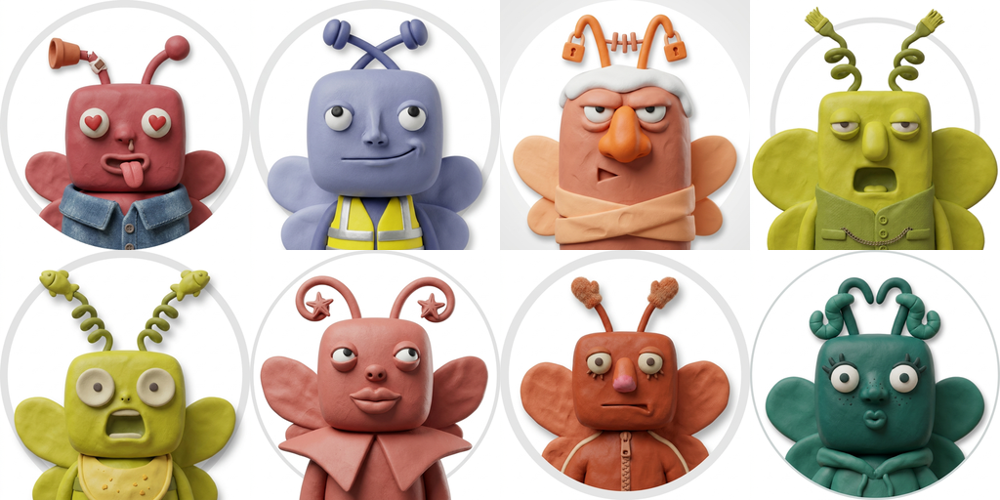

# buzz-bee-portraits

[](https://github.com/khayreali/buzz-bee-portraits/actions/workflows/ci.yml)

A generator for clay-style bee portraits, meant to be used as profile pictures for
Buzz agents. It writes an English prompt from a library of written components, sends
it to Google Gemini with three reference portraits attached, and gives you a bee that
belongs to the same set as the bees Buzz ships.



Eight portraits from eight random seeds, nothing hand picked.

## Install

One command. Nothing to clone:

```
curl -fsSL https://raw.githubusercontent.com/khayreali/buzz-bee-portraits/main/install.sh | sh
```

If you already have a clone, run `./install.sh` from inside it instead. That is the
whole install. The installer copies the skill, the scripts and the three reference
portraits into `~/.buzz/.agents/skills/bee-portrait/`. The skill is self contained, so
you never have to keep a checkout around or tell anything where one is. Restart your
agent and the bee-portrait skill appears in its skill list.

To inspect an install you already have, run `./install.sh --check`, which reports
what is missing. If your agents do not run in `~/.buzz`, set `BUZZ_NEST`, as in
`BUZZ_NEST=/path/to/nest ./install.sh`.

Python 3 is the only thing you need installed. Pillow is optional. Without it you get
the model's own resolution instead of a 384 pixel square, and everything else works
the same.

## The API key

This is the one thing you have to do yourself. Get a Google Gemini API key from
https://aistudio.google.com/apikey.

In Buzz Desktop, add it under Settings, Agents, Agent defaults, Advanced, Environment
variables, with the name `GEMINI_API_KEY`, and it is handed to every agent session.
In a shell, `export GEMINI_API_KEY=your-key-here` does the same job.

## Usage

The examples below use `bin/` from a clone. If you installed rather than cloned, the
same scripts are in the skill directory, so set this once and every example works
unchanged:

```
cd ~/.buzz/.agents/skills/bee-portrait
```

Start by assembling a prompt and printing it, which makes no network call and needs
no key:

```
python3 bin/assemble_bee.py --seed 7
```

It prints the slots it chose, then the prompt, which ends like this:

```
On top of its head it is wearing an open pea pod tipped upside down with the peas showing.
```

The same seed always produces the same choices, so you can share a seed and get the
same bee back. To choose slots by hand, use the flag named after the slot, with
underscores written as hyphens. Anything you do not name is still filled at random:

```
python3 bin/assemble_bee.py --base-colour cobalt --antennae coil --antenna-tip lamp
```

See what a slot holds with `python3 bin/assemble_bee.py --list chest`. Passing an
identifier that does not exist also prints every identifier the slot does have.

Then generate the image. Run the first command as often as you like, it only prints
the prompt and never calls the model. The second one costs money:

```
python3 bin/generate_bee.py --seed 7 --dry-run --out /dev/null
python3 bin/generate_bee.py --seed 7 --out mybee.png
```

`generate_bee.py` takes the same slot flags as the assembler, and `--out` is required.
It also takes `--size` (`1K`, `2K` or `4K`, default `1K`), `--dry-run`, `--keep-full`
to skip the downsample, `--refs` for different reference portraits, `--prompt-file`
for your own prompt text, and `--respect-taken`, covered below. It writes a small
JSON file beside the image recording the seed, the model, the size and every slot
choice, which is enough to reproduce the image later.

To put a portrait on an agent, run `buzz upload file --file mybee.png` and pass the
returned url to `buzz users set-profile --avatar`, which only ever updates the
identity that runs it.

## The component library

`bin/components.json` holds nine slots: base colour, antennae, antenna tip, eyes,
nose, mouth, chest, headwear and glasses. Most hold one hundred entries. They are
written sentences, not sprites, and nothing is composited. Each entry needs two
fields:

```
{"id": "coil", "phrase": "two tightly coiled spring antennae"}
```

The phrase goes into the prompt word for word, so write it the way you would describe
the thing to somebody sculpting it, not the way you would tag it. The `id` is what
you type after a flag such as `--antennae`.

To extend the library, add entries to the lists. There is no schema to update and no
registration step, and no list has a fixed length. The `_hard_rules` key in the same
file explains the conventions, including that headwear is decorative and never
encodes what an agent does, and that accessories stay rare, roughly one bee in six.

## The colour tool

`bin/clay_colours.py` picks base colours that stay visually separated from the bees
you already have, measured in CIELAB rather than by eye. Measure your existing
portraits first, because `--write` saves the result as `bin/roster.json`, which
`check` and `sample` both read:

```
python3 bin/clay_colours.py measure refs --write
python3 bin/clay_colours.py sample --count 5
python3 bin/clay_colours.py check '#D9A21B'
```

`sample` also takes `--json`, which prints entries shaped for `components.json`, and
`--swatch out.png`, which writes a labelled picture. Measuring and swatches use Pillow.

## Two things to know

The `taken_by` fields name somebody else's roster. Entries in `base_colour` and
`antenna_tip` are marked as claimed by Honey, Fizz, Bumble, Hive, Jelly, Comb and
Nectar, which are the original author's agents. `--respect-taken` filters out
anything carrying one, so on your machine it reserves components for bees that do not
exist. Leave the flag off, which is the default and is safe, or edit
`components.json` to carry your own names.

The glasses slot is filled but switched off. There are one hundred glasses entries
and the assembler never reaches them, because `_disabled_slots` contains `"glasses"`.
Remove it to turn the slot on. You can also pass `--glasses` with an identifier
without enabling the slot, since an explicit choice overrides the disabled list.

## What is in the repository

```
bin/                  the three scripts and components.json
refs/                 the reference portraits sent with every request
skills/bee-portrait/  the skill an agent loads, this is what install.sh copies
agents/               one persona, so the repository is a valid Buzz persona pack
.plugin/plugin.json   the pack manifest
tests/check_repo.py   the checks continuous integration runs
docs/                 the design reasoning
```

The skill is the part almost everybody wants, and `install.sh` installs exactly that.

The `agents/` and `.plugin/` directories make this a persona pack, which is the
format Buzz documents for shipping personas and skills together. Buzz can validate a
pack today with `buzz pack validate .`, but it has no command that installs one yet,
which is why `install.sh` exists. When an install path lands, this repository will
already be the right shape.

## Cost

Every portrait is a paid call to Google. At the default `1K` size it is roughly 13 to
14 cents per image, and `4K` is roughly 24 cents. Nothing is cached, so a rejected
image costs the same as a kept one, and you should expect two or three tries before
you like one. `--dry-run` never calls the model, so it is free.

## Licensing and attribution

This repository is licensed under Apache-2.0. See `LICENSE` and `NOTICE`. The three
reference portraits in `refs/` are derivative works. They come from
https://github.com/block/buzz, Copyright 2026 Block, Inc., also Apache-2.0, cropped
to square busts on a white background and resized. `refs/LICENSE` carries the
attribution notice and the statement of changes, and `refs/fetch.sh` re-derives the
files from the untouched originals if you want to verify that provenance. You do not
need to run it to use this project.

Apache-2.0 section 6 grants no rights in trade names or trademarks, and a mascot is
exactly the sort of thing that functions as brand identity. So, plainly: this is not
Block branding, it is not endorsed by Block, and nothing here implies any
relationship with Block. Generate bees for your own roster, and do not adopt Fizz,
Honey or Bumble as your own identity. That is what the licence files say, and it is
not legal advice.

## Further reading

[docs/BEE_PORTRAIT_SYSTEM.md](docs/BEE_PORTRAIT_SYSTEM.md) has the design reasoning:
why the system uses written descriptions instead of sprites, why the references go
with every request, and what survives at small sizes.
